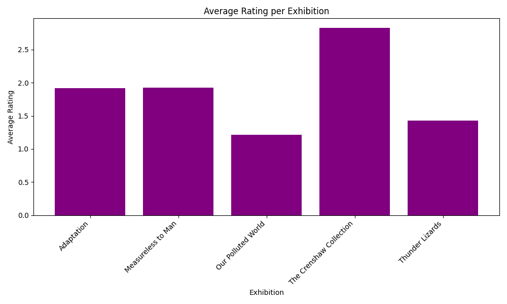
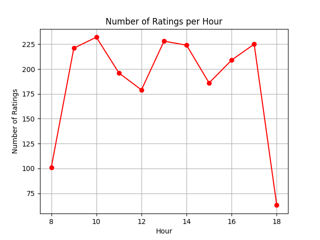

# Exhibition Ratings Report

This report contains two visualisations based on the ratings and interactions with exhibitions.

## Key Information
- The report analyses visitor ratings for each exhibition and the number of ratings over time.
- Exhibitions are rated on a scale from 0 to 4, with 0 being 'Terrible' and 4 being 'Amazing'.
- The visualisations are based on data from the `rating_interaction` and `exhibition` tables.

## Visualisations

### Average Rating per Exhibition

This bar chart shows the average rating for each exhibition based on visitor feedback. The exhibitions with higher average ratings are more positively received by the visitors.

### Number of Ratings per Hour

This line chart shows the number of ratings submitted by visitors for different exhibitions per hour.

---

**Database Schema**:  
The data was fetched from the following tables:
- **Exhibition**: Contains details about the exhibitions, including name, description, department, and floor.
- **Rating Interaction**: Logs each rating event, including the exhibition and rating given by the visitor.

